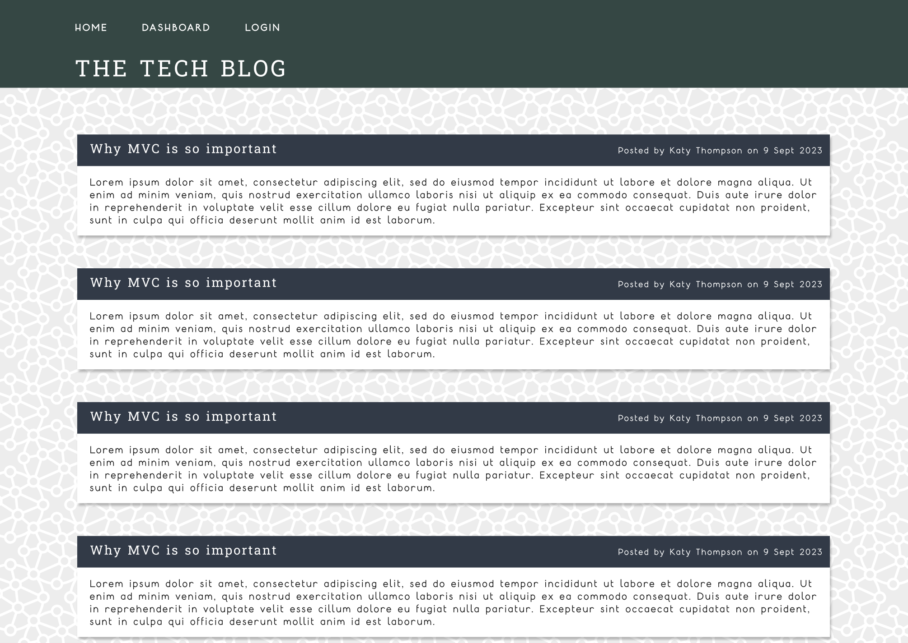

# Tech Blog

## Badges

## Description
A blog for developers to post their ideas, critiques and commentary on trending topics in the tech industry.

## Table of Contents
- [Features](#features)
- [Installation](#installation)
- [Usage](#usage)
- [License](#license)
- [Contributing](#contributing)
- [Tests](#tests)
- [Credits](#credits)
- [Questions](#questions)

## Features
- Create, edit and delete blog posts about tech topics
- Read and comment-on others' blog posts

## Screenshot

## License
All assets and code are under MIT License unless specified otherwise.

## Questions
Any questions? Visit my GitHub profile at [https://github.com/katyjmt](https://github.com/katyjmt) or email me at [katyjmt@gmail.com](katyjmt@gmail.com).